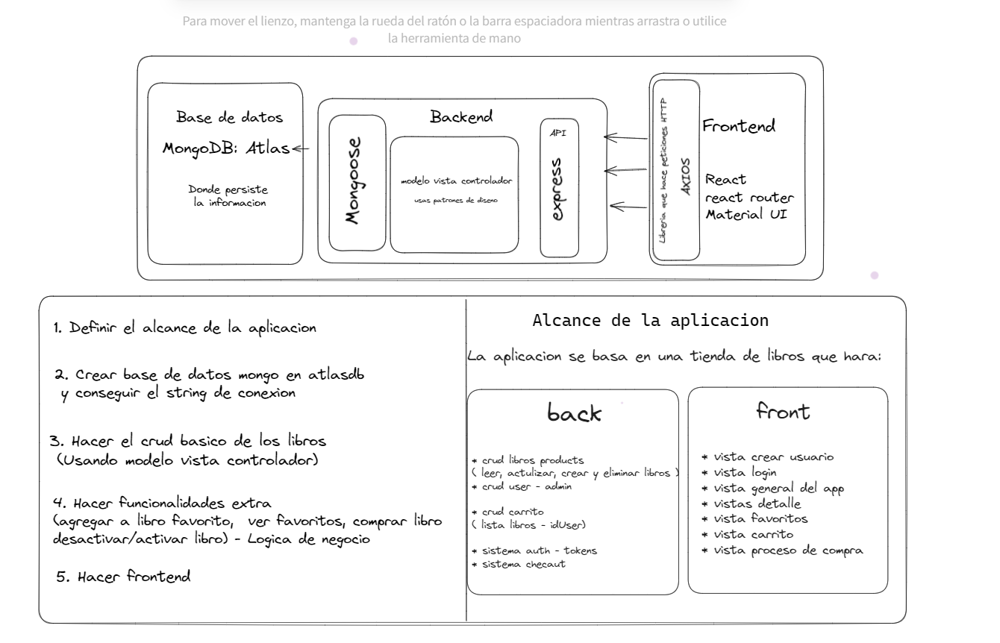

# Tienda de Libros

 Tienda de libros en Node.js utilizando MongoDB como base de datos.

## Descripción y alcance de la App

La Tienda de Libros es una aplicación web que permite a los usuarios explorar y comprar libros en línea. La aplicación utiliza una base de datos MongoDB para almacenar la información de los libros, usuarios y toda la parte de autenticacion y autorizacion.

### Diagrama:




## Características

- Búsqueda de libros por título y categoría.
- Visualización detallada de información de libros.
- Carrito de compras para agregar y gestionar los libros seleccionados.
- Tendrá una sección para libros favoritos.
- Proceso de pago seguro integrado.
- Gestión de usuarios, incluyendo registro y inicio de sesión.

## Tecnologías
```javascript
- JavaScript
- Node.js
```
## Dependencias

- dotenv: Para la carga de variables de entorno.
- express: Para crear la aplicación web y gestionar las rutas.
- jsonwebtoken: Para la autenticación basada en tokens.
- mongoose: Para interactuar con la base de datos MongoDB.
- nodemon: Para reiniciar automáticamente el servidor durante el desarrollo.
- bcrypt: Para el cifrado de contraseñas.


## Herramientas adicionales

- **MongoDB Compass**: Una interfaz gráfica para administrar y visualizar datos en MongoDB.

- **Postman**: Una herramienta para probar y documentar APIs.
1. Clona el repositorio de GitHub:
```
git clone <URL del repositorio>
```
2. Instala las dependencias:
```javascript
- npm install dotenv
- npm install express
- npm install jsonwebtoken
- npm install mongoose
- npm install nodemon 
- npm install bcrypt
```
3. Configuración de la base de datos:
- Asegúrate de tener MongoDB en funcionamiento en tu sistema.
- Crea una base de datos llamada "tienda_libros" en MongoDB.

4. Configuración del entorno:
- Crea un archivo `.env` en la raíz del proyecto.
- Agrega las siguientes variables de entorno en el archivo `.env`:

  ```
  CONNECTION_DB = mongodb://localhost:27017/tienda_libros
  SECRETSTRING= para hacer el hasheo
  SECRET_KEY=your_secret_key
  ```

5. Inicia la aplicación:
```
npm start 
```

6. Accede a la aplicación en tu navegador web:

```
http://localhost:3000
```